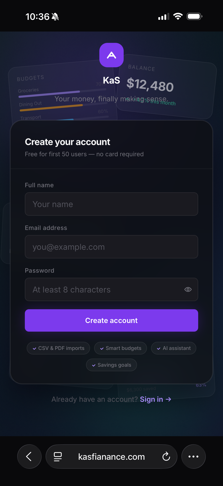
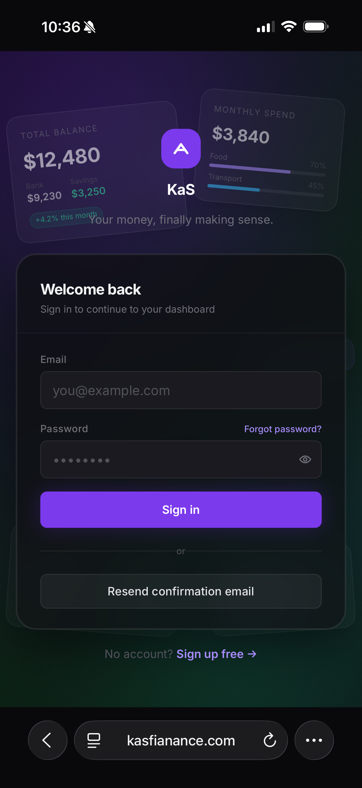
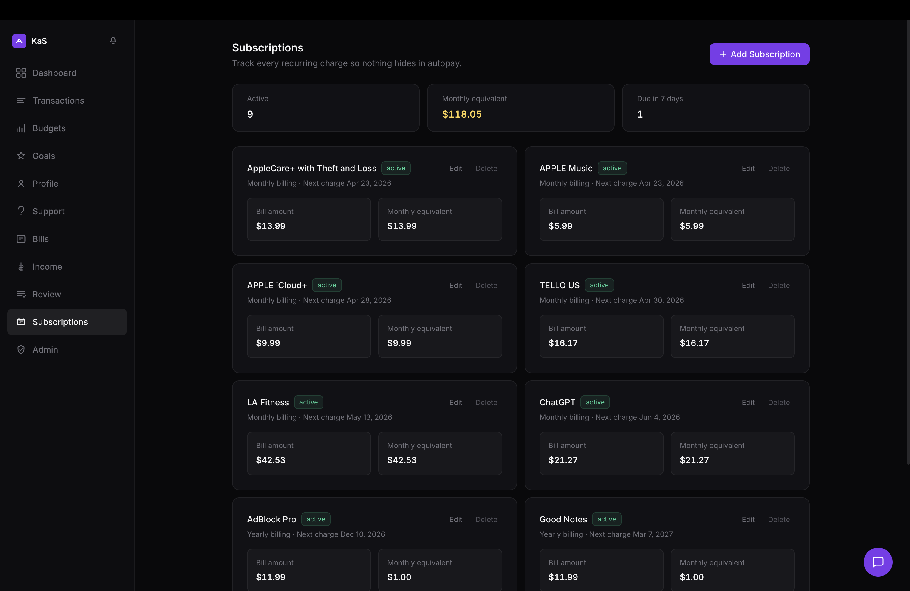
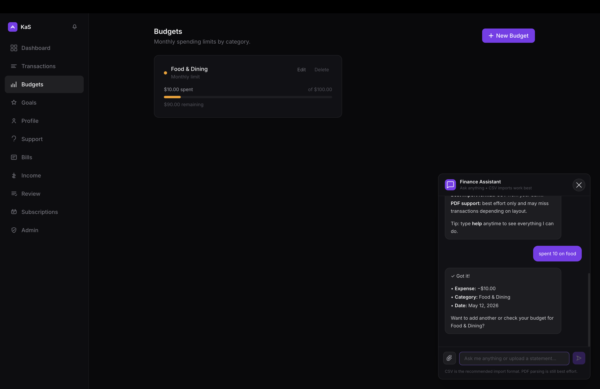
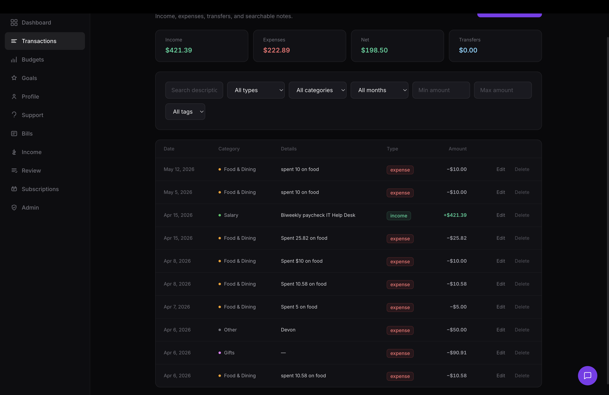
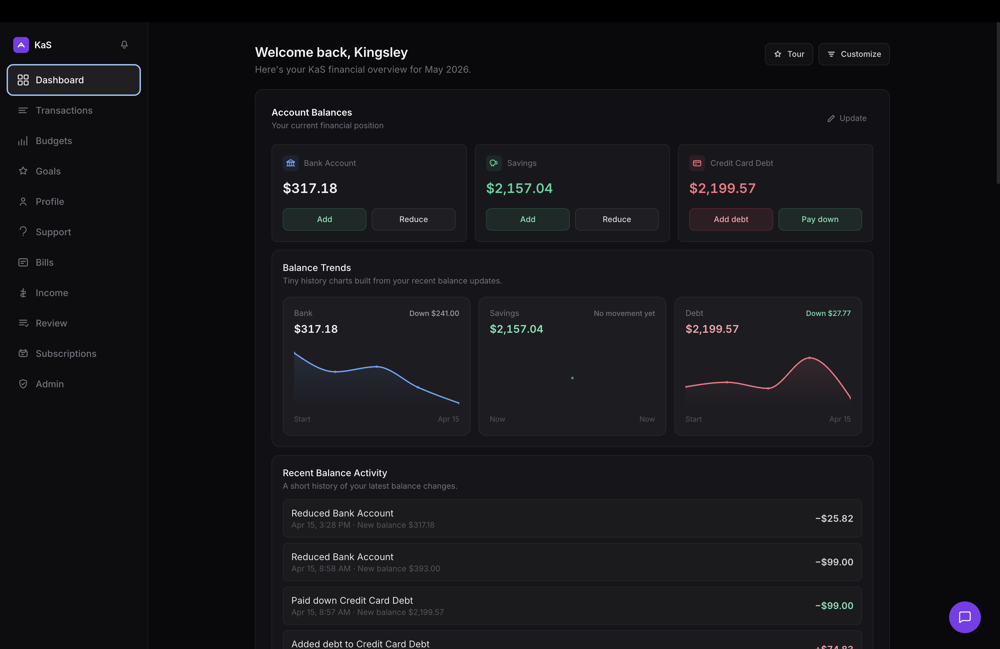

# KaS Finance

KaS Finance is a modern personal finance dashboard for tracking balances, transactions, budgets, goals, bills, subscriptions, and AI-assisted financial activity in one responsive web app.

[Live Site](https://kasfianance.com)

## Highlights

- Secure sign in and account creation flow
- Dashboard overview for bank balance, savings, and credit card debt
- Transaction tracking with filters for type, category, month, tag, and amount
- Budget monitoring by spending category
- Recurring subscription tracker with monthly equivalents and due dates
- Finance assistant for quick natural-language transaction entry
- Responsive mobile authentication screens
- Public showcase repository with sensitive production details removed

## Screenshots

### Mobile Experience

<p>
  
  
</p>

### Subscriptions



### Budget



### Transactions



### Dashboard



## Tech Stack

### Frontend

- Next.js
- React
- TypeScript
- Tailwind CSS

### Backend

- Supabase
- PostgreSQL
- Node.js

### Deployment & Tools

- Vercel
- GitHub
- GitHub Actions

## Architecture

KaS Finance uses a full-stack architecture with a Next.js client, Supabase authentication and backend services, PostgreSQL persistence, protected API routes, and real-time data workflows for financial activity.

## Local Setup

```bash
git clone https://github.com/kkotey14/KaSpublic.git
cd KaSpublic
npm install
npm run dev
```

Create a `.env.local` file with the required environment variables before running the app locally.

## Security

This repository is a public showcase version of KaS Finance. Production secrets, sensitive infrastructure settings, and private backend configuration are not included.

## Roadmap

- AI-powered financial insights
- Advanced analytics dashboard
- Recurring transaction automation
- Budget forecasting tools
- Multi-user collaboration support

## Author

Kingsley Kotey

- Portfolio: [kkotey.com](https://kkotey.com)
- LinkedIn: [Kingsley Kotey](https://linkedin.com/in/kingsley-kotey-476649278)
